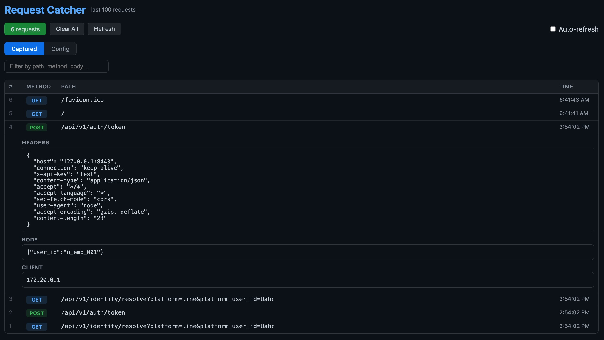

# Request Catcher

HTTP request capture and response mock server for testing and debugging.



## Quick Start

```bash
docker compose up
```

Open http://localhost:8443 — send requests, watch them appear in the table.

## How It Works

1. **All requests** to any path are captured and shown in the frontend (last 100, in-memory)
2. **Response rules** in `responses.yaml` let you configure exact replies — status code, headers, body, even simulated delay
3. **Unmatched requests** fall through to a catch-all handler that returns a JSON acknowledgment

## Response Rules

Edit `responses.yaml` — the server hot-reloads it via the frontend Config tab or `POST /__config/reload`.

```yaml
rules:
  - path: /api/hello
    method: GET
    status_code: 200
    headers:
      Content-Type: application/json
    body: '{"message": "hello"}'

  - path_pattern: /api/users/.*
    method: GET
    status_code: 200
    body: '{"users": [{"id": 1, "name": "Alice"}]}'

  - path: /api/slow
    delay_ms: 3000
    body: '{"done": "after 3s"}'
```

Matching priority: `method` filter first, then `path` (exact match), then `path_pattern` (regex). First match wins.

## Per-Rule Auth

A rule can require a specific auth header. If the request doesn't carry it (or carries the wrong value), the request is rejected with a configurable failure response. The request is still captured and visible in the UI.

```yaml
rules:
  - path: /api/secret
    method: GET
    auth:
      header: X-API-Key
      values: ["alpha-key", "beta-key"]
    on_auth_failure:
      status_code: 401
      body: '{"error":"unauthorized"}'
    status_code: 200
    body: '{"secret":"data"}'
```

For JWT-style auth, match the full `Authorization` value (including the `Bearer` prefix):

```yaml
- path: /api/me
  method: GET
  auth:
    header: Authorization
    values: ["Bearer eyJhbGciOiJIUzI1NiJ9..."]
  status_code: 200
  body: '{"user_id":"u_emp_001"}'
```

Header name lookup is case-insensitive. Value comparison is case-sensitive. If `on_auth_failure` is omitted, defaults are `401` + `{"error":"unauthorized"}` + `Content-Type: application/json`.

## Per-Rule Conditional Match

Return different responses based on a request's query string or body values. Write one rule per scenario; first match wins.

```yaml
rules:
  - path: /api/v1/auth/token
    method: POST
    match:
      user_id: u_emp_001
    status_code: 200
    body: '{"token":"<jwt-for-alice>"}'

  - path: /api/v1/auth/token
    method: POST
    match:
      user_id: u_emp_002
    status_code: 200
    body: '{"token":"<jwt-for-bob>"}'
```

`match` values must be strings; quote numbers in YAML (`count: "5"`). Body is parsed as JSON; non-JSON bodies fall back to query-string matching. When the same key appears in both, body wins. Multiple `match` keys are AND'd.

## Management Endpoints

| Endpoint | Description |
|---|---|
| `GET /` | Frontend UI |
| `GET /__requests` | List captured requests (JSON) |
| `GET /__requests/{id}` | Single request detail |
| `DELETE /__requests` | Clear all stored requests |
| `GET /__config` | Current response rules (JSON) |
| `POST /__config/reload` | Hot-reload `responses.yaml` |

## Run Locally

```bash
uv sync --extra dev
uv run uvicorn app.main:app --reload
```

## Run Tests

```bash
uv sync --extra dev
uv run pytest -v
```
